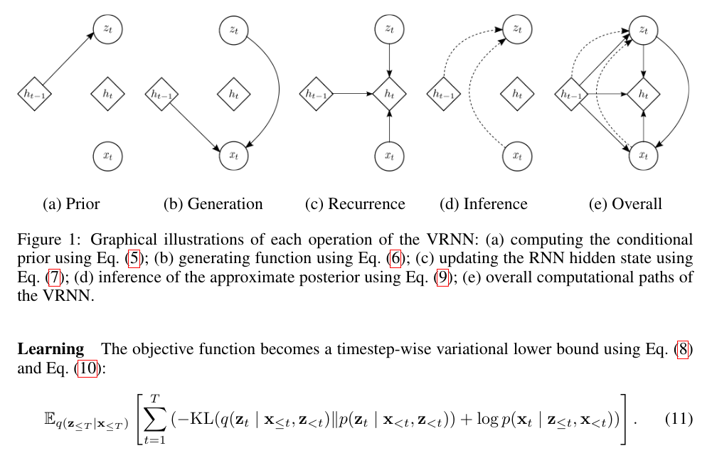

This repository implements the Variational Recurrent Neural Network (VRNN) in `PyTorch`. There is a demo with the MNIST dataset.

This implementation is from *A Recurrent Latent Variable Model for Sequential Data*, Junyoung Chung et. all ([https://arxiv.org/abs/1506.02216](https://arxiv.org/abs/1506.02216)). The following image from the paper illustrates model's operations and its objective function.

# Requirements

* The repository was created with `Python 3.11` but newer versions compatible with the other libraries should also work.
* `PyTorch 2.9.1`
* `pytorch-lightning 2.5.6`
* `torchmetrics 1.8.2`
* `torchvision 0.24.1`

Feel free to open issues and discussions for improvements.
